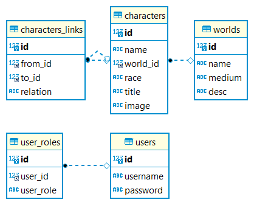

# Character Database Management #

This application manages a database of characters and worlds for keeping track of growing amounts of characters and relationships within novels and tabletop RPGs like Dungeons and Dragons.

The management system is built using Spring Boot, with Spring Security, Spring Data JPA, JSP and Bootstrap, for a simple easy to use and edit design.

# Database

# License

GNU General Public
